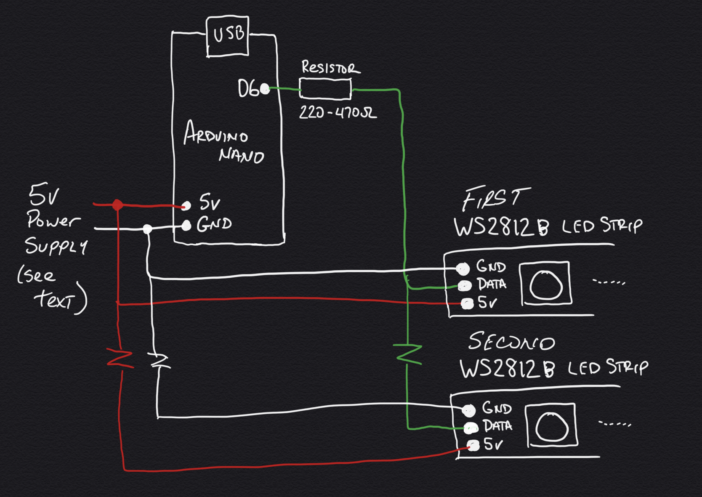

# Kaleidoscope Tunnel
Flite Test is doing a build video on the Kaleidoscope Tunnels that Jesse Perkins and I helped build for their Whoop Course at Edgewater Airpark. This GitHub is in support of that video.

# New To GitHub?
Since there will be many new users coming to the platform in search of this code, no fear, you only need a few things from here. (1) This document on electronic parts, links, and code modifications, and (2) the code itself. You've already found this document, and the code is downloaded by using the green button above that says "Clone or Download". Select "Download ZIP" and expand it in your arduino code or documents folder. The code is located in the "hyperDrive" folder. That's all you really need to get started.
If you would like to get more involved in adding to the project, visit GitHub's [Getting Started Tutorial](https://help.github.com/en/github/getting-started-with-github) to learn how to get involved.

# Electronics Build
**Electronic Parts** 
- 1 Arduino NANO
- 1 roll WS2812B LED Strips (see below) 
- 2 Resistor (220-470 ohm) - Optional but suggested
- Various Wire
- Heatshrink to cover exposed wire and electronics
- Power Supply - See section below

When purchasing your WS2812b LED Strips, be sure you purchase with the following options: WS2812b, 5v, 5m, IP30, 60 leds/meter or 300 led/roll, and your choice of white or black backing.  Purchasing the strips domestically can be somewhat expensive ($30+ for 5m versus $14 from China), but you can get them fast from [Amazon](https://www.amazon.com/ALITOVE-Addressable-Programmable-Waterproof-Raspberry/dp/B07FVR6W71).
**OR**, if you have a little time to spare, they can be found on [AliExpress](https://www.aliexpress.com/item/32967769057.html?spm=a2g0o.productlist.0.0.7c2f44acFOGNrr&algo_pvid=ee8a77ca-49d0-4429-a4f1-6f4021579add&algo_expid=ee8a77ca-49d0-4429-a4f1-6f4021579add-2&btsid=0ab6f82215836105170277264e77fb&ws_ab_test=searchweb0_0,searchweb201602_,searchweb201603_) for under $14 per 5m roll. 

The connections are fairly simple and can be repeated for as many LED strands you want in your gate.
# 

## IMPORTANT - Power Supply Selection
You will need a 5v power supply for this gate. The type and rating of the power supply you select depends on the **TOTAL** number of LEDs that will be in your gate. As a rule of thumb, you will need about 18W of power at 5v for every meter of LEDs you are running, which is about 60 LEDs. The gates at Flite Test used 110 LEDs per end for a total of 220. This works out to a [100w power supply](https://www.amazon.com/ALITOVE-Transformer-Adapter-Converter-Charger/dp/B06XK2DDW4).

# Programming
If you encounter issues on programming your NANO boards, please refer to my [BBT Race Gate Project](https://github.com/Teknoid303/BBTRaceGateProject#firmware) for more details.
Included here is a very simple code that will be uploaded to each Nano/LED Strip you have at the ends of your mirrors. The pattern changes from one to another in a sequenced pattern with 20 seconds between changes. If you would like to change the switching time, change the following line in your code.

#define SECONDS_PER_PAT    20 

**Number of LEDs** - When installing the LEDs on your Kaleidoscope Tunnel, the number of LEDs may differ from those we used on the tunnels at Flite Test, so be sure and count your LEDs and change the following line as needed:

#define NUM_LEDS         110

**Brightness** - Your Kaleidoscope Tunnel may be in a dark room, which will require the dimming of the LEDs so that they don't become blinding to the FPV camera. Reduce the number below to your liking. The number runs from 0-255, with 255 being the brightest. 63 is 1/4 brightness, 127 is 1/2, and 191 is 3/4.

#define INIT_BRIGHTNESS   63

# LICENSE
This is a completely open-source project. Share the code as you wish, or use it for any purpose you'd like. 
